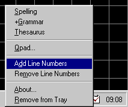



## QCheck \(Utilities for your VB IDE\)

### Description

Code editors in programming languages like Visual Basic, Access, SQL Server etc., don't provide a spell checker, and sometimes I was forced to cut and paste text back and forward from Microsoft Word. QCheck allow me to access the power of Microsoft Word quickly and painlessly. To use it is very simple; highlight a word or sentence then right-click the QCheck icon from the System Tray and select one of these options:

1. Spelling (also accessible by left-clicking the icon)

2. +Grammar

3. Thesaurus

4. Add Line Numbers (adds line numbers on selected text)

5. Remove Line Numbers (removes line numbers on selected text)

6. A simple text editor can be found by clicking Qpad from the popup menu.

From here, spelling and grammar can be checked without highlighting the text. In addition, clicking the OK menu option, the corrected text will be sent to the application the editor was hooked onto (Do this by clicking the Set menu option).

The last two options are especially useful for programmers wanting to add or remove line numbers in code editors with minimal effort.
 
### More Info
 
Requirements:

1. Microsoft Word 97 or Word 2000

             |
---                |---
**Submitted On**   |2001-02-20 09:58:30
**By**             |[Frank Addati](https://github.com/Planet-Source-Code/PSCIndex/blob/master/ByAuthor/frank-addati.md)
**Level**          |Intermediate
**User Rating**    |4.8 (43 globes from 9 users)
**Compatibility**  |VB 6\.0
**Category**       |[Complete Applications](https://github.com/Planet-Source-Code/PSCIndex/blob/master/ByCategory/complete-applications__1-27.md)
**World**          |[Visual Basic](https://github.com/Planet-Source-Code/PSCIndex/blob/master/ByWorld/visual-basic.md)
**Archive File**   |[CODE\_UPLOAD15633312001\.zip](https://github.com/Planet-Source-Code/frank-addati-qcheck-utilities-for-your-vb-ide__1-21414/archive/master.zip)

